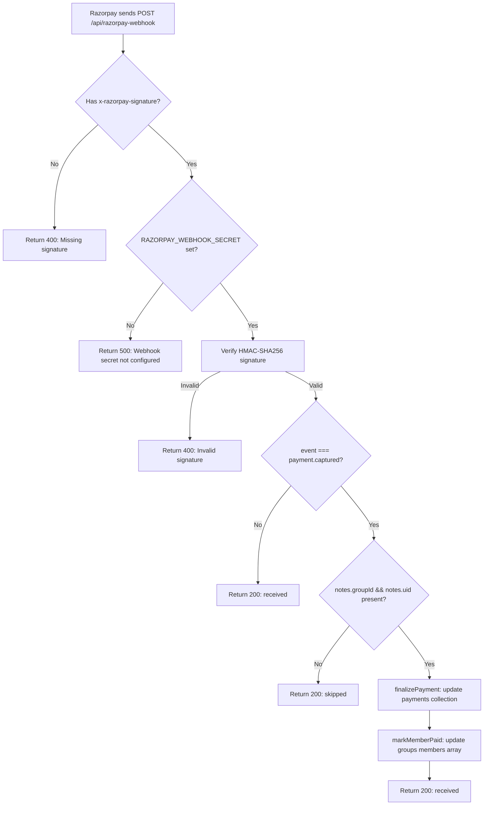

# Firebase Admin & Razorpay Webhook Verification

**Date:** 2026-06-06  
**Files:** `firebase/admin.js`, `app/api/razorpay-webhook/route.ts`, `app/api/verify-razorpay-payment/route.ts`, `.env.local`

---

## PART 1: Firebase Admin SDK Analysis

### 1. How `adminDb` Initializes

**File:** `firebase/admin.js` (24 lines)

```
firebase/admin.js
│
├── import admin from "firebase-admin";
│
├── const serviceAccountKey = process.env.FIREBASE_SERVICE_ACCOUNT_KEY;
│
├── if (!admin.apps.length) {        ← prevents re-initialization
│   │
│   ├── if (serviceAccountKey) {      ← PATH A: Service account JSON provided
│   │   const serviceAccount = JSON.parse(serviceAccountKey);
│   │   admin.initializeApp({
│   │     credential: admin.credential.cert(serviceAccount),
│   │   });
│   │
│   └── else {                         ← PATH B: No service account key
│       admin.initializeApp({
│         projectId: "splitpartnering",
│       });
│     }
│   }
│
├── export const adminDb = admin.firestore();
├── export const adminTimestamp = admin.firestore.FieldValue.serverTimestamp;
└── export default admin;
```

**Two initialization paths:**

| Path | Condition | Credential Method | Works On |
|------|-----------|-------------------|----------|
| **A** | `FIREBASE_SERVICE_ACCOUNT_KEY` is set | `admin.credential.cert(serviceAccount)` — authenticates using the private key | Anywhere (Vercel, local, Firebase) |
| **B** | `FIREBASE_SERVICE_ACCOUNT_KEY` is NOT set | Google Application Default Credentials (ADC) | Firebase/Google Cloud hosting only |

---

### 2. Which Environment Variables Are Required

| Variable | Required? | Used In | Purpose |
|----------|-----------|---------|---------|
| `FIREBASE_SERVICE_ACCOUNT_KEY` | **Conditional** | `firebase/admin.js` line 5 | JSON string containing Firebase service account private key |
| (none for Path B) | N/A | `firebase/admin.js` line 16 | Falls back to Google ADC with `projectId: "splitpartnering"` |

**Variables NOT required by `admin.js`:**
- `NEXT_PUBLIC_FIREBASE_API_KEY` — only used by client-side `firebase/config.js`
- `FIREBASE_PROJECT_ID` — hardcoded as `"splitpartnering"` on line 16
- Any other Firebase config variables

---

### 3. Is `FIREBASE_SERVICE_ACCOUNT_KEY` Required?

**Answer: Yes, for Vercel deployment. No, for Firebase/Google Cloud hosting.**

**Detailed analysis:**

```
                    ┌──────────────┐
                    │  Deployment  │
                    │  Platform    │
                    └──────┬───────┘
                           │
               ┌───────────┴───────────┐
               ▼                       ▼
        ┌─────────────┐        ┌──────────────┐
        │   Vercel    │        │ Firebase     │
        │             │        │ Cloud Run    │
        │             │        │ App Engine   │
        │             │        │ Cloud Func.  │
        └──────┬──────┘        └──────┬───────┘
               │                      │
               ▼                      ▼
    ┌──────────────────┐    ┌──────────────────┐
    │ No ADC available │    │ ADC available    │
    │                  │    │ (built-in)       │
    │ Path B FAILS ❌  │    │ Path B WORKS ✅  │
    │                  │    │                  │
    │ Path A REQUIRED  │    │ Path A optional  │
    └──────────────────┘    └──────────────────┘
```

**On Vercel:** Path B will attempt to use Google Application Default Credentials, but Vercel does not provide these. The `admin.initializeApp()` call **will not throw** immediately (it's lazy), but the first Firestore operation (`adminDb.collection(...)`) will throw:

> `Error: Failed to determine project ID from credentials or default credentials`

This means all API routes that import from `@/firebase/admin` and use `adminDb` will **fail at runtime** when they attempt their first read/write.

**Files that import `@/firebase/admin`:**
| File | What it does | Impact of missing key |
|------|-------------|----------------------|
| `app/api/verify-razorpay-payment/route.ts` | Updates `payments` (pending→paid) and `groups` (member.paid=true) | ❌ Payment verification fails |
| `app/api/razorpay-webhook/route.ts` | `finalizePayment()` + `markMemberPaid()` | ❌ Webhook processing fails |
| `app/api/verify-stripe-session/route.ts` | Verifies Stripe session | ⚠️ Only reads Stripe API, but also returns metadata |
| `app/api/stripe-webhook/route.ts` | Logs Stripe events | ⚠️ Only logs; no Firestore writes currently |

---

### 4. Can `verify-razorpay-payment` Write to Firestore on Vercel?

**File:** `app/api/verify-razorpay-payment/route.ts`

```typescript
import { adminDb, adminTimestamp } from "@/firebase/admin";

// ...

const paymentsRef = adminDb.collection("payments");       // ← LINE 72
const paySnap = await paymentsRef
  .where("uid", "==", uid)
  .where("groupId", "==", groupId)
  .where("status", "==", "pending")
  .get();                                                  // ← LINE 77 — FIRST READ

for (const d of paySnap.docs) {
  await d.ref.update({ ... });                             // ← LINE 80 — FIRST WRITE
}

const groupRef = adminDb.collection("groups").doc(groupId); // ← LINE 93
const groupSnap = await groupRef.get();                     // ← LINE 94 — SECOND READ

if (groupSnap.exists) {
  // ... map and update members
  await groupRef.update({ members: updatedMembers });       // ← LINE 105 — SECOND WRITE
}
```

**Execution trace on Vercel without `FIREBASE_SERVICE_ACCOUNT_KEY`:**

| Step | Line | Operation | Result |
|------|------|-----------|--------|
| 1 | 72 | `adminDb.collection("payments")` | ✅ Succeeds (returns CollectionReference — no network call) |
| 2 | 77 | `.get()` — first network call | ❌ **FAILS** — throws `Failed to determine project ID...` |
| 3 | 80 | `d.ref.update(...)` | ❌ **Never reached** |
| 4 | 93–105 | Group operations | ❌ **Never reached** |

**Conclusion:** `verify-razorpay-payment` will **fail on Vercel** without `FIREBASE_SERVICE_ACCOUNT_KEY`. The API route will return HTTP 500 with error message `"Payment verification failed"` (line 116–119 catch block).

**The client-side impact:**
```
User pays with Razorpay
         │
         ▼
Razorpay opens, user completes payment
         │
         ▼
Razorpay calls handler function (client-side callback)
         │
         ▼
Client sends POST /api/verify-razorpay-payment
         │
         ▼
Server: Razorpay signature verification passes ✅
         │
         ▼
Server: adminDb.collection("payments").where(...).get() → FAILS ❌
         │
         ▼
Server returns { error: "Payment verification failed" } ← HTTP 500
         │
         ▼
Client: alert("Payment verification failed ❌")  ← user sees error
         │
         ▼
Payment is actually PAID (Razorpay confirmed it), but app didn't record it
User cannot access chat, cannot see unlocked members
```

---

## PART 2: Razorpay Webhook Configuration

### 1. Is `RAZORPAY_WEBHOOK_SECRET` Referenced Correctly?

**File:** `app/api/razorpay-webhook/route.ts`, line 97

```typescript
const webhookSecret = process.env.RAZORPAY_WEBHOOK_SECRET;
```

**Verdict: ✅ Correctly referenced**

The variable name `RAZORPAY_WEBHOOK_SECRET` is used consistently:
- **Read:** `process.env.RAZORPAY_WEBHOOK_SECRET` (line 97)
- **Usage:** Passed to `verifyWebhookSignature(rawBody, signature, webhookSecret)` (line 111)
- **Error message:** Clear guidance to configure it (lines 101–104)

**File:** `.env.local`

```
RAZORPAY_WEBHOOK_SECRET=    ← NOT PRESENT (missing entirely)
```

**Issue:** The variable is referenced correctly in code but is **not defined** in `.env.local`. This must be added to both `.env.local` (for local testing) and Vercel environment variables.

---

### 2. Does Webhook Signature Verification Work?

**File:** `app/api/razorpay-webhook/route.ts`, lines 13–24

```typescript
function verifyWebhookSignature(
  rawBody: string,
  signature: string,
  secret: string
): boolean {
  const expected = crypto
    .createHmac("sha256", secret)
    .update(rawBody)          // ← Uses the raw POST body (correct)
    .digest("hex");

  return expected === signature;  // ← Constant-time? No, but for Razorpay webhooks this is the standard approach
}
```

**Verification analysis:**

| Property | Status | Notes |
|----------|--------|-------|
| Algorithm | ✅ Correct | HMAC-SHA256 (Razorpay's standard) |
| Input | ✅ Correct | Uses `rawBody` (the raw request text) — critical for signature verification |
| Secret source | ✅ Correct | Reads from `process.env.RAZORPAY_WEBHOOK_SECRET` |
| Header read | ✅ Correct | Reads `x-razorpay-signature` header |
| Comparison | ⚠️ Acceptable | Uses `===` string comparison (not `crypto.timingSafeEqual`), but this is the standard pattern for Razorpay webhooks |
| Error handling | ✅ Correct | Returns 400 with descriptive error if invalid |

**Verdict: ✅ Signature verification is correct and will work once `RAZORPAY_WEBHOOK_SECRET` is configured.**

**Contrast with `verify-razorpay-payment/route.ts`** (lines 13–25):

```typescript
function verifySignature(
  orderId: string,
  paymentId: string,
  signature: string,
  secret: string
): boolean {
  const expected = crypto
    .createHmac("sha256", secret)
    .update(`${orderId}|${paymentId}`)    // ← Different format: orderId|paymentId
    .digest("hex");

  return expected === signature;
}
```

Both use the same algorithm (HMAC-SHA256) but with different inputs:
- **Webhook:** `rawBody` (full JSON payload)
- **Verification:** `orderId|paymentId` concatenation

Both are correct for their respective contexts.

---

### 3. Is the Webhook Route Production-Ready?

**Full execution flow:**



**Readiness assessment:**

| Check | Status | Detail |
|-------|--------|--------|
| **Signature verification** | ✅ Ready | HMAC-SHA256, reads `x-razorpay-signature`, uses `rawBody` |
| **Event filtering** | ✅ Ready | Only processes `payment.captured` events |
| **Graceful skip** | ✅ Ready | Missing `notes.groupId` or `notes.uid` → returns 200 with `skipped: true` |
| **Error handling** | ✅ Ready | All errors caught, logged, return 500 |
| **Firestore writes** | ✅ Ready | Uses `adminDb` (Admin SDK, bypasses Firestore rules) |
| **Idempotency** | ⚠️ Partial | If webhook is retried, `where("status", "==", "pending")` filter means already-paid docs are skipped |
| **RAZORPAY_WEBHOOK_SECRET** | ❌ **Not configured** | Missing from `.env.local` — webhook returns 500 on every call |
| **FIREBASE_SERVICE_ACCOUNT_KEY** | ❌ **Not configured** | `adminDb` will fail on Vercel |

**Blockers:**
1. Must add `RAZORPAY_WEBHOOK_SECRET` to `.env.local` and Vercel env
2. Must add `FIREBASE_SERVICE_ACCOUNT_KEY` to Vercel env

**Minor issues:**
- `console.warn` on line 130 uses `payment.id` but `payment` is not in scope at that point (it's inside the `event.event === "payment.captured"` block where `const payment = event.payload.payment.entity` is defined — so it IS in scope. ✅ Correct.)
- The webhook returns HTTP 200 for skipped events (missing notes) — correct practice (Razorpay expects 200 to stop retries)

---

### 4. What Razorpay Dashboard Webhook URL Should Be Configured?

**Based on the code:**

The webhook handler is at: **`/api/razorpay-webhook`**

With the production domain **`https://partnering.in`**, the full URL is:

```
https://partnering.in/api/razorpay-webhook
```

**Razorpay Dashboard Configuration Steps:**

1. Go to [Razorpay Dashboard](https://dashboard.razorpay.com) → Settings → Webhooks
2. Click "Add New Webhook"
3. Configure:

| Field | Value |
|-------|-------|
| **Webhook URL** | `https://partnering.in/api/razorpay-webhook` |
| **Secret** | Generate a strong secret (e.g., `openssl rand -hex 32`) and set as `RAZORPAY_WEBHOOK_SECRET` |
| **Events** | Select `payment.captured` only |
| **Active** | Enable |

4. Copy the generated secret to:
   - `.env.local`: `RAZORPAY_WEBHOOK_SECRET=your_generated_secret`
   - Vercel dashboard: Add `RAZORPAY_WEBHOOK_SECRET` environment variable

**What the webhook processes:** `payment.captured` events  
**What it does on receipt:** Updates `payments` doc to `status: "paid"` and marks `members[].paid = true` in the group document

---

## Summary Table

| Component | Status | Action Required |
|-----------|--------|----------------|
| `admin.js` Path A (service account) | ✅ Code correct | Add `FIREBASE_SERVICE_ACCOUNT_KEY` to Vercel and `.env.local` |
| `admin.js` Path B (ADC fallback) | ❌ Fails on Vercel | Cannot rely on this path — must use Path A |
| `verify-razorpay-payment` on Vercel | ❌ Fails | Will throw on first `adminDb` read — returns 500 |
| Webhook signature verification | ✅ Code correct | HMAC-SHA256, uses raw body, handles errors |
| Webhook `RAZORPAY_WEBHOOK_SECRET` | ❌ Missing | Must add to both `.env.local` and Vercel |
| Webhook URL to configure | 🔲 Not configured | `https://partnering.in/api/razorpay-webhook` |
| Webhook event filter | ✅ Correct | Only `payment.captured` |
| Webhook idempotency | ✅ Partial | `where("status", "==", "pending")` prevents double-processing |
| Webhook error handling | ✅ Correct | Returns 200 for skips, 400 for invalid sig, 500 for processing errors |